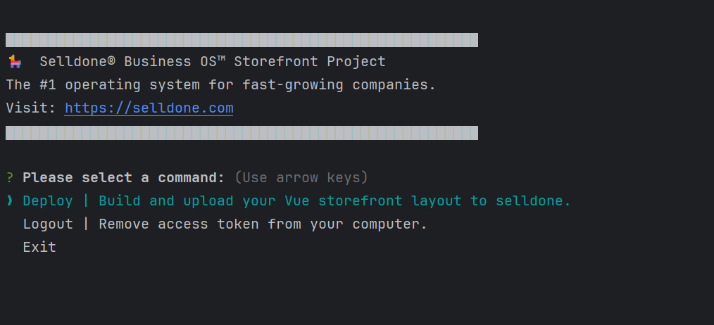

# Selldone CLI

🛍️ Go to the [**Full Storefront Project ▶**](https://github.com/selldone/storefront)

## Introduction

Welcome to the documentation for `selldone cli`, a command-line tool designed for seamless deployment of custom
storefront layouts for Selldone users. Selldone, accessible at [Selldone.com](https://www.selldone.com), is a
comprehensive e-commerce platform that empowers businesses and individual entrepreneurs to create, manage, and grow
their online presence effortlessly.

### What is Selldone?

Selldone is an innovative e-commerce solution that offers a wide range of features to facilitate online store
management, sales, marketing, and much more. It provides a user-friendly interface and powerful tools to create a unique
and efficient online shopping experience.

### What is a Layout?

In the context of Selldone, a Layout refers to a custom storefront design. It allows users to personalize their online
shop's appearance and functionality, creating a unique brand experience for their customers. To get started with a fully
customizable storefront project, 🛍️ Go to the [**Full Storefront Project ▶**](https://github.com/selldone/storefront).

## Using Selldone CLI

`Selldone CLI` is an essential tool for developers looking to integrate their custom Layouts into the Selldone platform.
This tool facilitates the process of building, packaging, and deploying your storefront designs onto the Selldone
platform.

### Prerequisites

Before using `Selldone CLI`, ensure that you have Node.js installed on your system. The tool is designed to run on Node.js
and requires a basic understanding of JavaScript and command-line operations.

### Installation

```shell
npm install -g selldone-cli
```
or install locally: `npm install selldone-cli --save-dev` or `yarn add selldone-cli --dev`

### Local installation (Dev mode)

```shell
npm uninstall -g selldone-cli
npm install -g .
```

### Usage

To run `Selldone CLI`, navigate to the directory containing your Vue project and execute it:

```bash
selldone
```



The script will guide you through the process of deploying your custom Layout. Follow the prompts to authenticate,
build, and upload your project to Selldone.

## Features

- **Authentication**: Securely log in to your Selldone account via OAuth2.
- **Build and Zip**: Automatically build your project and package it into a zip file.
- **Upload**: Seamlessly upload your zip file to the Selldone platform.
- **Version Control**: Ensure that each version of your Layout is unique and properly managed.


## Publish Package

URL: https://www.npmjs.com/package/selldone-cli

```shell
npm publish
```

## Contributing

Contributions to `Selldone CLI` are welcome! If you have suggestions, improvements, or bug fixes, feel free to fork the
repository, make changes, and submit a pull request.

## License

`Selldone CLI` is released under the MIT License.


---

Enjoy building and deploying your custom storefronts with Selldone!

---

For more information about customizing your Selldone storefront, visit
the [Full Storefront Project](https://github.com/selldone/storefront).

Happy coding! 🚀